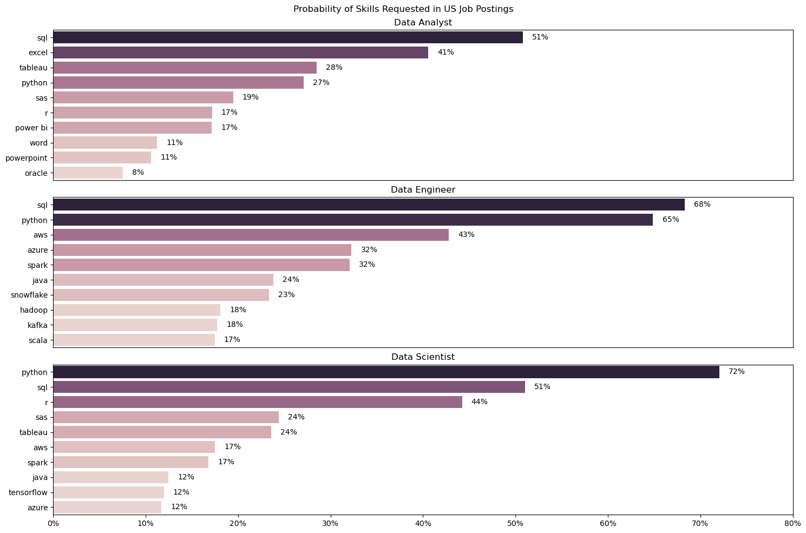
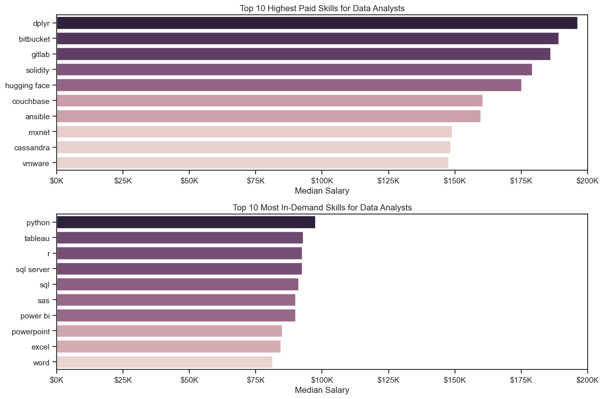

# OVERVIEW

This is my data analytics project, where I analysed data related job postings and information such as salaries and skills needed for each job. Through this project, I hoped to further improve my data analytics skills and expand my knowledge on certain libraries such as pandas, matplotlib, and seaborn. I also wanted to find insights on which skills were most in demand and highest paying for data related roles. I found this salary and employee data from Luke Barousse's python course, where I was able to establish a strong foudation in data analytics. 

# QUESTIONS
  These are the questions that I intended to answer through data visualization.
  1) What are the most in demand skills for Data Analysts?
  2) How do the skills demanded change over the course of a year?
  3) How do the salaries of different roles and different skills compare?
  4) What are the most optimal skills to learn to get a high paying role in a data role?

# Tools Used
  - Python (libraries)
      - Pandas. Used to clean, filter, and manipulate dataframes in order to create visualizations
      - MatPlotLib. Used to create basic visualizations that can answer some of the questions above and give insights into the job market.
      - Seaborn. Used to create more advanced visualizations that can offer more visually appealling visualizations and offer more layers of information
  - Jupyter notebook
      - Used to write python scripts and compare outputs of dataframes and visualizations
  - VSCode
      - The main IDE I Used to run python scripts
  - Git/GIthub
      - Used to share my project
   
  # Initial Data Cleaning & Filtering
  The Dataset originally contained the column named 'date_posted' (representing the date the job was posted as a string). I converted it into a datetime object for easier manipulation later on. Secondly, the 'job_skills' column contained the skills for each job as a string containing a list ('[python,r,sql]'). I then used the ast library and the literal_eval() function to convert this string into a list. Due to the size of the dataset, for some visualizations I chose to only analyze American roles. I did so by filtering the dataframe by the 'job_country' column. 

```python
df['job_posted_date'] = pd.to_datetime(df['job_posted_date'])
df['job_skills'] = df['job_skills'].apply(lambda x: ast.literal_eval(x) if pd.notna(x) else x)
```

# Part 1

For the first question. I wanted to find the top 3 most frequent roles in the dataset. This ultimately was for Data Analysts, Data Scientists, and Data Engineers. From here I used the explode() method and aggregated the data to find the counts for each role and for each skill. After sorting the counts, I was able to find the most frequently posted skills for each role. I then was able to convert the counts to percentages of the total job postings for each role, this allows for the counts to be better represented. 



## Results
From this visualization, I was able to conclude that in the top 3 most frequent data related roles (scientist, analyst, and engineer) sql is the most frequently occuring skill. Therefore for someone just starting out in their career, sql is a valuable skill to learn early on. Additonally, we can also see that the skills for data engineering are more specialized and have less overlap compared to the other roles. 


# Part 2
For this part, I specifically looked at Data analyst roles. I did so by filtering the dataframe for Data Analytics positions located in the US. I then looked at the month that each position was posted so that I could aggregate the data by each month and each skill. This allowed me to create the graph that looked at the skills trending over time. 


## Results
This visualization reiterates the fact that sql is a very important and in-demand skill for data analysts as it is the highest line on the graph. Additionally, all the skills follow a similar trend over time where they slightly decrease or stay level throughout the year. This gives good insight for people looking for data analytics positions as it may be slightly more advantageous to apply earlier in the year. 


# Part 3
For this part, I created two visualizations. The first one compared six roles and the distributions of their yearly salaries. I did this through a boxplot graph. In this graph we are able to extract more information about the salaries for each role, including the median and more advanced distribution statistics such as the interquartile range and the lower and upper extremes. 

For the second visualization, I looked once again only at Data analysts. From here, I compared the highest paying skills, and then I compared the most in-demand skills and their median salaries. I combined these two graphs into one by using matplotlib's subplots function. This allowed for a better comparison between all the different skills. 




## Results
After looking at the first visualization, I was able to see that Data Analysts have the lowest median salary out of the main data roles. However they have a smaller IQR and overall range than most of them, this can indicate that these roles are more consistent with their salaries. Additionally, Data Scientists have a very large spread, showing that their can be lots of varying factors determining the salary of a data scientist.

For the second visualization, we are able to see that many of the most in-demand skills are not the highest paying skills. This can be slightly misleading as people may think it would be more valuable to learn these very high paying skills. However, as seen in the aggregated dataframes, the counts for these skills are very low, meaning that there will be very few opportunities and that the salary may be misrepresented due to the smaller sample size. 

<div>
<style scoped>
    .dataframe tbody tr th:only-of-type {
        vertical-align: middle;
    }

    .dataframe tbody tr th {
        vertical-align: top;
    }

    .dataframe thead th {
        text-align: right;
    }
</style>
<table border="1" class="dataframe">
  <thead>
    <tr style="text-align: right;">
      <th></th>
      <th>count</th>
      <th>median</th>
    </tr>
    <tr>
      <th>job_skills</th>
      <th></th>
      <th></th>
    </tr>
  </thead>
  <tbody>
    <tr>
      <th>dplyr</th>
      <td>2</td>
      <td>196250.0</td>
    </tr>
    <tr>
      <th>bitbucket</th>
      <td>3</td>
      <td>189000.0</td>
    </tr>
    <tr>
      <th>gitlab</th>
      <td>3</td>
      <td>186000.0</td>
    </tr>
    <tr>
      <th>solidity</th>
      <td>1</td>
      <td>179000.0</td>
    </tr>
    <tr>
      <th>hugging face</th>
      <td>1</td>
      <td>175000.0</td>
    </tr>
    <tr>
      <th>couchbase</th>
      <td>1</td>
      <td>160515.0</td>
    </tr>
    <tr>
      <th>ansible</th>
      <td>1</td>
      <td>159640.0</td>
    </tr>
    <tr>
      <th>mxnet</th>
      <td>2</td>
      <td>149000.0</td>
    </tr>
    <tr>
      <th>cassandra</th>
      <td>6</td>
      <td>148250.0</td>
    </tr>
    <tr>
      <th>vmware</th>
      <td>1</td>
      <td>147500.0</td>
    </tr>
  </tbody>
</table>
</div>


